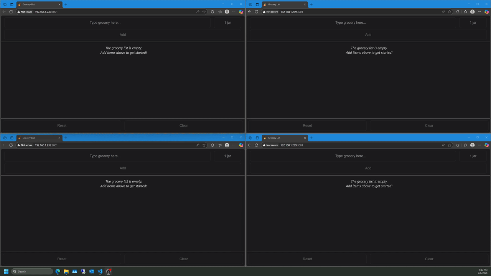

# 🛒 GrocerySync

A real-time collaborative **grocery list app** powered by **React + Vite** on the frontend and **NestJS** on the backend. Built for speed, minimalism, and synchronization across all your devices.

> 🌀 WebSocket-based real-time updates.  
> 🧠 Built with modular architecture.  
> 📱 Designed for mobile and desktop use.  




---

## 🚀 Features

- ✅ Real-time sync between clients via WebSockets
- ✅ Clean and responsive UI with [Vite](https://vitejs.dev/)
- ✅ Modular backend with [NestJS](https://nestjs.com/)
- ✅ SQLite database for lightweight local storage
//- ✅ Unique grocery sets via URL slug (e.g. `/list/1`)
- ✅ Lightweight enough to run on a Raspberry Pi Zero 2W 💡

---

## 🧱 Tech Stack

| Frontend | Backend |
|----------|---------|
| React + Vite | NestJS + WebSocket Gateway 
| TypeScript | TypeORM + SQLite 
| Zod Validation | Modular Gateway Services 

---

## 🛠️ Local Development

### 🖥 Backend (NestJS)

```bash
# Install dependencies
npm install

# Start development server
npm run start:dev
```

### 🌐 Frontend (React + Vite)

```bash
# Install dependencies
npm install

# Start frontend server
npm run dev
```
